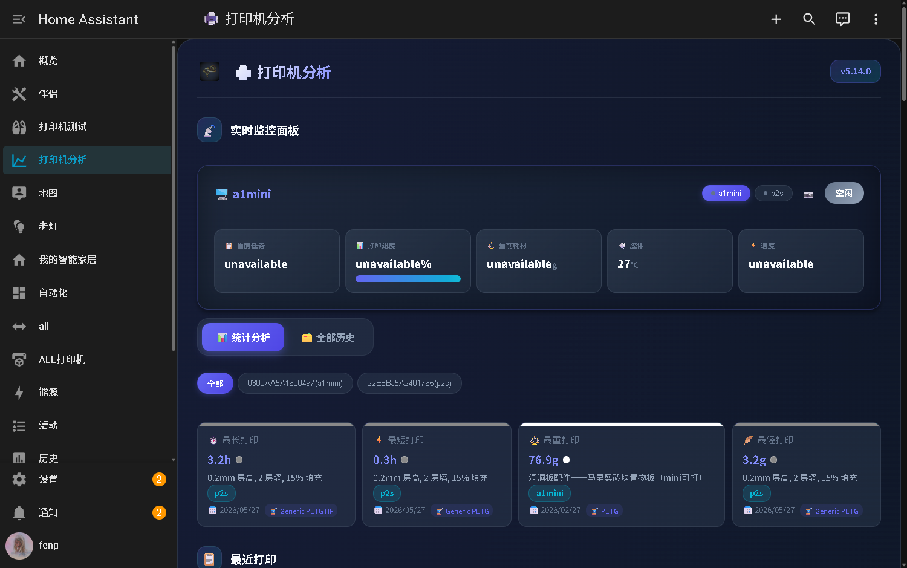
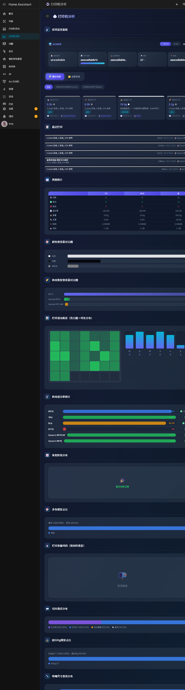
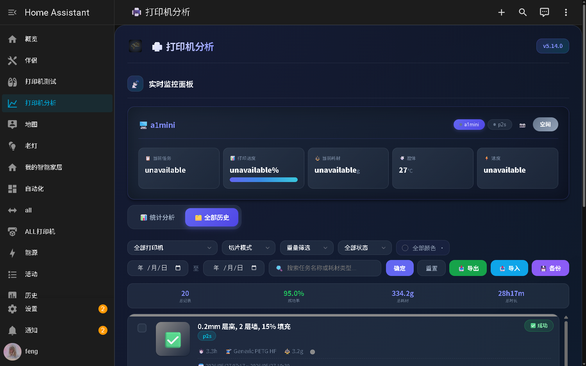

# Printer Analytics - 3D 打印机数据分析

[](https://github.com/hacs/integration)
[](https://github.com/michaelggr/ha-printer-analytics)
[](https://qm.qq.com/q/9paJFuZbCE)

Home Assistant 自定义集成，用于追踪和分析 3D 打印机数据。与拓竹（Bambu Lab）打印机无缝协作。

**English** | [中文](#中文文档)

## 展示

| 实时监控与统计概览 | 统计分析图表 | 打印历史记录 |
|:---:|:---:|:---:|
|  |  |  |

---

<a id="中文文档"></a>

## 功能特性

### 数据追踪
- **打印历史** — 自动记录每次打印：任务名、耗材类型/颜色/重量、时长、能耗、喷嘴/热床/腔体温度、速度配置、切片模式等
- **智能任务名捕获** — 监听 task_name 实体变化，精确区分模型名、项目名和参数配置名
- **封面图与快照** — 自动下载打印封面图；快照抓取前自动开舱内灯，抓取后恢复
- **摄像头实时画面** — 自动发现摄像头实体，支持实时视频流和自动刷新
- **腔体温度** — 记录打印结束前5分钟的腔体温度（平均/最高/最低）
- **design_id** — MakerWorld 模型 ID，详情弹窗可点击跳转

### 统计分析
- **终身统计** — 总打印次数、成功率、平均时长、总时长、总重量、总长度、总能耗
- **7天/30天周期统计** — 每个周期8个指标表格展示
- **成功率趋势** — 累计成功率 SVG 折线图
- **时长分布** — 按时间段统计打印数量（柱状图）
- **活动热力图** — 最近5周的每日打印活动
- **耗材使用** — 按耗材类型和颜色的饼图
- **6种新增图表** — 多色占比、切片模式分布、超500g占比、喷嘴尺寸分布、准备时间、失败仓温

### Lovelace 卡片
- **现代玻璃拟态设计** — 渐变背景、流畅动画、响应式布局
- **三种显示模式** — `stats`（仅统计）、`history`（仅历史）、默认（Tab 切换）
- **多打印机支持** — 合并显示多台打印机的历史记录，实时监控面板支持切换按钮
- **实时监控** — 喷嘴/热床/腔体温度、打印进度、AMS 料盘信息、功耗
- **高级筛选** — 按状态 + 日期范围 + 颜色 + 关键词 + 切片模式 + 超500g + 打印机筛选
- **分页显示** — 每页20条，高效浏览大数据集
- **详情弹窗** — 点击记录查看完整打印详情
- **CSV 导出** — 兼容 Excel（含 BOM 头）
- **批量删除** — 选择多条记录确认删除
- **JSON 导入** — 智能合并，仅填充空字段

### 数据安全
- **年份分片存储** — 数据按年份存储在独立 JSON 文件中
- **自动备份同步** — 每次保存自动同步到 `www/printer_analytics_data/`（HA 快照会包含）
- **压缩归档** — 每月自动创建 gzip 压缩备份，保留最近12个
- **自动恢复** — 重装集成时自动从备份目录恢复数据（entry_id 变化也不影响）
- **旧版迁移** — 自动将旧版单文件数据迁移到年份分片格式

## 关联项目

| 项目 | 说明 |
|------|------|
| [bambu-print-history-export](https://github.com/michaelggr/bambu-print-history-export) | 拓竹打印历史导出工具 — 从 Bambu Cloud 批量导出打印记录为 JSON/CSV，可导入本集成 |

如果你有大量历史打印记录存储在拓竹云端，可以先用 [bambu-print-history-export](https://github.com/michaelggr/bambu-print-history-export) 导出，再通过本集成的 JSON 导入功能合并到 HA 中。

## 安装

### HACS 安装（推荐）

[](https://my.home-assistant.io/redirect/hacs_repository/?owner=michaelggr&repository=ha-printer-analytics&category=integration)

1. 进入 HACS → 集成
2. 点击右上角三个点 → 自定义仓库
3. 添加 `https://github.com/michaelggr/ha-printer-analytics` 为集成
4. 搜索 "Printer Analytics" 并安装
5. 重启 Home Assistant

### 手动安装

1. 下载最新 [Release](https://github.com/michaelggr/ha-printer-analytics/releases)
2. 将 `custom_components/printer_analytics/` 复制到 HA 的 `custom_components/` 目录
3. 重启 Home Assistant

## 配置

1. 进入 **设置** → **设备与服务** → **添加集成**
2. 搜索 **"Printer Analytics"**
3. 填写表单：

| 配置项 | 说明 | 必填 |
|--------|------|------|
| 打印机名称 | 打印机的显示名称 | 是 |
| 打印状态传感器 | 打印状态实体（如 `sensor.p2s_xxx_print_status`） | 是 |
| 功率传感器 | 功率传感器实体 | 否 |
| 能耗传感器 | 能耗传感器实体 | 否 |
| 腔体温度传感器 | 腔体温度传感器实体 | 否 |

## Lovelace 卡片

集成安装后会自动创建仪表板。也可手动添加卡片：

### 基础配置

```yaml
type: custom:printer-analytics-card
title: 我的打印机
print_history: sensor.my_printer_print_history
total_prints: sensor.my_printer_total_prints
success_rate: sensor.my_printer_success_rate
average_duration: sensor.my_printer_average_duration
total_print_duration: sensor.my_printer_total_print_duration
total_energy: sensor.my_printer_total_energy
material_stats_7d: sensor.my_printer_7day_stats
material_stats_30d: sensor.my_printer_30day_stats
duration_distribution: sensor.my_printer_duration_distribution
activity_heatmap: sensor.my_printer_activity_heatmap
print_status: sensor.my_printer_print_status
```

### 完整配置

```yaml
type: custom:printer-analytics-card
title: P2S 打印机分析
mode: stats                    # stats | history | (空=Tab切换)
printer_name: P2S
print_history: sensor.p2s_print_history
total_prints: sensor.p2s_total_prints
success_rate: sensor.p2s_success_rate
average_duration: sensor.p2s_average_duration
total_print_duration: sensor.p2s_total_print_duration
total_energy: sensor.p2s_total_energy
material_stats_7d: sensor.p2s_7day_stats
material_stats_30d: sensor.p2s_30day_stats
material_stats_lifetime: sensor.p2s_lifetime_stats
duration_distribution: sensor.p2s_duration_distribution
failure_stage_distribution: sensor.p2s_failure_stage_distribution
filament_success_stats: sensor.p2s_filament_success_stats
activity_heatmap: sensor.p2s_activity_heatmap
print_status: sensor.p2s_print_status
current_task: sensor.p2s_task_name
print_progress: sensor.p2s_print_progress
current_weight: sensor.p2s_print_weight
nozzle_temp: sensor.p2s_nozzle_temperature
bed_temp: sensor.p2s_bed_temperature
chamber_temp: sensor.p2s_chamber_temperature
active_tray: sensor.p2s_active_tray
power_consumption: sensor.p2s_power
speed_profile: sensor.p2s_speed_profile
nozzle_size: sensor.p2s_nozzle_size
ams_tray_1: sensor.p2s_ams_1_tray_1
ams_tray_2: sensor.p2s_ams_1_tray_2
ams_tray_3: sensor.p2s_ams_1_tray_3
ams_tray_4: sensor.p2s_ams_1_tray_4
extra_print_histories:
  - entity: sensor.a1mini_print_history
    name: a1mini
```

### 卡片配置选项

| 选项 | 说明 |
|------|------|
| `mode` | 显示模式：`stats`（仅统计）、`history`（仅历史）、空=Tab切换 |
| `printer_name` | 打印机名称，用于多打印机标签显示 |
| `extra_print_histories` | 额外打印机历史实体列表，用于多打印机合并显示 |
| `material_stats_lifetime` | 终身统计实体（设置后隐藏摘要中的总耗材项） |

## 传感器

| 传感器 | 说明 |
|--------|------|
| `sensor.{name}_total_prints` | 总打印次数 |
| `sensor.{name}_success_rate` | 成功率 (%) |
| `sensor.{name}_average_duration` | 平均打印时长 (小时) |
| `sensor.{name}_total_print_duration` | 打印总时长 (小时) |
| `sensor.{name}_total_energy` | 总能耗 (kWh) |
| `sensor.{name}_material_stats_lifetime` | 终身耗材统计 |
| `sensor.{name}_material_stats_7d` | 7天耗材统计 |
| `sensor.{name}_material_stats_30d` | 30天耗材统计 |
| `sensor.{name}_duration_distribution` | 打印时长分布 |
| `sensor.{name}_activity_heatmap` | 打印活动热力图 |
| `sensor.{name}_failure_stage_distribution` | 失败阶段分布 |
| `sensor.{name}_filament_success_stats` | 耗材成功率统计 |
| `sensor.{name}_print_history` | 打印历史记录 |
| `sensor.{name}_print_status` | 当前打印状态 |

## 服务

| 服务 | 说明 | 参数 |
|------|------|------|
| `printer_analytics.refresh_stats` | 强制重新计算所有统计数据 | `entity_id`（必填） |
| `printer_analytics.reset_history` | 清除所有打印历史 | `entity_id`（必填） |
| `printer_analytics.delete_history_records` | 按ID删除指定记录 | `entity_id`（必填），`record_ids`（必填） |
| `printer_analytics.backfill_cover_images` | 补全缺失的封面图 | `entity_id`（必填） |
| `printer_analytics.backfill_snapshots` | 补全缺失的快照图 | `entity_id`（必填） |
| `printer_analytics.backfill_task_names` | 从拓竹云补全缺失的任务名称 | `entity_id`（必填） |
| `printer_analytics.backfill_record_fields` | 补全缺失的参数字段（喷嘴/热床/层数等） | `entity_id`（必填） |
| `printer_analytics.export_data` | 导出打印历史为 JSON 文件 | `entity_id`（必填） |
| `printer_analytics.import_data` | 从 JSON 文件导入打印历史（智能合并） | `entity_id`（必填） |

## 数据存储与备份

| 路径 | 说明 | HA 备份 |
|------|------|---------|
| `config/.printer_analytics/history_by_year/` | 主数据（按年份分片） | 不包含 |
| `config/.printer_analytics/archives/` | 压缩月度备份 | 不包含 |
| `config/www/printer_analytics_data/` | 自动同步的备份副本 | 包含 |
| `config/www/printer_analytics/` | 封面图与快照 | 包含 |

## 架构

```
custom_components/printer_analytics/
├── __init__.py           # 入口，服务注册，仪表盘自动部署
├── config_flow.py        # UI 配置流程
├── const.py              # 常量与配置
├── coordinator.py        # 数据更新协调器，打印生命周期管理
├── data_models.py        # 数据类（PrinterStats, PrintRecord）
├── entity_discovery.py   # 自动发现 bambu_lab 打印机实体
├── image_manager.py      # 封面图与快照下载，拓竹云认证
├── print_tracker.py      # 打印开始/结束检测，耗材追踪
├── sensor.py             # HA 传感器实体（每台打印机14个传感器）
├── statistics.py         # 统计计算（带增量缓存）
├── storage.py            # 年份分片 JSON 存储，备份与恢复
├── utils.py              # 安全工具（SecureFileHandler, URLValidator）
└── www/
    └── pa-v5.11.js       # Lovelace 自定义卡片
```

## 系统要求

- Home Assistant 2024.1.0 或更新版本
- 一个打印机集成（如 [bambu_lab](https://github.com/greghesp/ha-bambulab)）用于实体自动发现

> **兼容性说明**：HA 2026.x 将内部 `LovelaceData` 结构从 dict 改为对象，本集成已更新以同时支持新旧版本。

## 常见问题

### 找不到实体

确保 `bambu_lab` 集成已正确配置且打印机在线。

### 卡片不显示

确保 `pa-v5.11.js` 资源已加载。使用 Ctrl+Shift+R 清除浏览器缓存。

### 摄像头快照黑屏

- 检查打印机摄像头是否可访问
- 如果打印机 IP 变更，需要重新配置 Bambu Lab 集成
- 舱内灯自动开关功能需要发现 `chamber_light` 实体

### 任务名显示项目名而非模型名

Bambu Lab 的 task_name 实体会先短暂显示模型名（约15秒），然后切换为项目名。集成通过监听 task_name 变化事件自动捕获模型名。如果集成启动时打印已经开始，可能无法捕获，下次打印时会自动解决。

## 交流与反馈

- **QQ 交流群**：[323999366](https://qm.qq.com/q/9paJFuZbCE)（反馈问题、交流玩法）
- **问题反馈**：[GitHub Issues](https://github.com/michaelggr/ha-printer-analytics/issues)

## 许可证

MIT License
