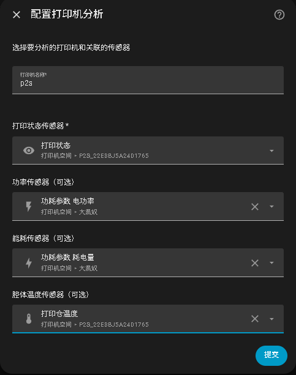

# Printer Analytics（打印机分析）

在 Home Assistant 中追踪和分析你的 3D 打印机数据。与 Bambu Lab 打印机（P2S、A1 Mini 等）通过 `bambu_lab` 集成无缝协作。

## 功能特性

- **打印历史追踪** - 完整的打印记录，包含任务名、层数、喷嘴类型、热床类型、耗材等
- **智能任务名捕获** - 监听 task_name 实体变化，精确区分模型名、项目名和参数配置名
- **时间维度统计** - 总打印次数、成功率、平均时长、能耗统计
- **周期统计** - 7天和30天聚合数据
- **6种分析图表** - 多色占比、切片模式分布、超500g占比、喷嘴尺寸分布、准备时间、失败仓温
- **内置 Lovelace 卡片** - 精美的图表和可视化，无外部依赖
- **自动封面图** - 自动下载并显示打印封面图
- **智能快照抓取** - 抓取前自动打开舱内灯，抓取后恢复原状态
- **摄像头实时画面** - 自动发现摄像头实体，支持实时视频流和自动刷新图片
- **自动发现** - 自动检测 `bambu_lab` 集成的打印机实体
- **多打印机支持** - 实时监控面板支持打印机切换按钮
- **全局删除** - 支持删除已离线/已删除打印机的记录
- **数据导入导出** - CSV导出、JSON导入（智能合并，仅填充空字段）
- **双语界面** - 支持中英文

## 支持的打印机

- Bambu Lab P2S
- Bambu Lab A1 Mini
- 其他打印机可通过自定义配置支持

## 安装

### HACS 安装（推荐）

1. 在 Home Assistant 中打开 HACS
2. 进入集成
3. 搜索 "Printer Analytics"
4. 点击安装

### 手动安装

1. 将 `printer_analytics` 文件夹复制到 `custom_components` 目录
2. 重启 Home Assistant

## 配置

### 通过 UI 配置

1. 进入 设置 → 设备与服务 → 添加集成
2. 搜索 "Printer Analytics"
3. 填写配置信息（如下图所示）



### 配置项说明

| 选项 | 说明 | 必填 | 推荐配置 |
|------|------|------|----------|
| 打印机名称 | 打印机的显示名称 | 是 | 如 `P2S`、`A1 Mini` |
| 打印状态实体 | 打印机打印状态传感器 | 是 | `bambu_lab` 集成的 `sensor.xxx_print_status` |
| **功率实体** | 实时功率传感器 | 否 | **米家计量版插座**的功率实体（`sensor.xxx_power`） |
| **能耗实体** | 累计能耗传感器 | 否 | **米家计量版插座**的电量实体（`sensor.xxx_energy`） |
| 腔体温度实体 | 打印舱内温度传感器 | 否 | `bambu_lab` 集成的 `sensor.xxx_chamber_temperature` |

### ⚡ 功耗/能耗传感器推荐：米家计量版插座

> **为什么要配？** 配置后可统计每次打印的实时功耗和累计用电量，在统计面板中查看能耗数据。

**推荐设备：小米/米家智能插座（计量版）**

- 通过 Home Assistant 的 `Xiaomi Miot Auto` 或 `Local Tuya` 集成接入
- 功率实体示例：`sensor.xiaomi_plug_power`（单位：W）
- 能耗实体示例：`sensor.xiaomi_plug_energy`（单位：kWh）
- 使用时将打印机电源插入计量插座即可自动记录

### 🌡️ A 系列打印机仓温传感器推荐

> **背景**：Bambu Lab A1 / A1 Mini 等机型**没有内置舱温传感器**，`bambu_lab` 集成不会提供 `chamber_temperature` 实体。如需统计失败打印时的舱内温度分布，可配置第三方温度传感器。

**推荐方案：在打印机舱内放置蓝牙/Zigbee 温湿度计**

- **米家蓝牙温湿度计 2** — 通过 `Xiaomi Miot Auto` 集成接入，实体示例：`sensor.mi_temperature_humidity_temperature`
- **涂鸦智能温湿度传感器** — 通过 `Local Tuya` 集成接入
- **其他品牌** — 任何能接入 HA 的温度传感器均可（需为 `sensor` 域）

配置时将第三方温度传感器填入「腔体温度实体」字段即可，集成会自动将其数据纳入统计面板中的「失败仓温分布」图表。

## Lovelace 卡片

安装后，集成会自动创建仪表板。在侧边栏的"打印机分析"中访问。

### 手动卡片配置

```yaml
type: custom:printer-analytics-card
title: "打印机分析"
print_history: sensor.p2s_p2s_da_yin_li_shi
print_status: sensor.p2s_p2s_da_yin_zhuang_tai
current_task: sensor.p2s_xxx_task_name
print_progress: sensor.p2s_xxx_print_progress
nozzle_temp: sensor.p2s_xxx_nozzle_temperature
bed_temp: sensor.p2s_xxx_bed_temperature
```

## 服务

集成提供以下服务：

| 服务 | 说明 |
|------|------|
| `printer_analytics.refresh_stats` | 刷新统计数据 |
| `printer_analytics.reset_history` | 重置打印历史 |
| `printer_analytics.delete_history_records` | 删除指定的历史记录 |
| `printer_analytics.backfill_cover_images` | 补全缺失的封面图 |
| `printer_analytics.backfill_snapshots` | 补全缺失的打印快照 |

## 更新日志

### v5.14.0 (2026-05-26)

- **修复**：模型名捕获 - idle 状态下只关注 task_name 变化事件，不再缓存静态值（避免缓存上一次打印的项目名）
- **修复**：模型名→项目名过渡捕获 - 当 task_name 从模型名变为不同的非参数描述值时，保留模型名
- **新增**：`gcode_file_downloaded` 实体发现，作为模型名回退数据源
- **新增**：`extract_model_from_gcode_filename` 工具函数，从 gcode 文件名提取模型名

### v5.13.0 (2026-05-25)

- **功能**：切片模式新增 auto_repeat（自动重复），统计图表和导入模板同步更新
- **功能**：新增全局删除 WS 命令，支持删除已删除打印机的记录
- **功能**：删除后即时更新 UI，无需手动刷新
- **修复**：打印机筛选不生效（_source_serial 未参与匹配）
- **修复**：删除记录不生效（coordinator 匹配、内存缓存限制、BOM 导致加载失败）

### v5.12.0 (2026-05-24)

- **功能**：打印记录新增6个字段：AMS使用、多色打印、速度模式、准备时间、切片模式、超500g
- **功能**：统计分析新增6个图表
- **功能**：数据导入导出（CSV导出、JSON导入智能合并）
- **功能**：design_id 字段（MakerWorld模型ID），详情弹窗可点击跳转

### v5.11.0 (2026-05-20)

- **修复**：线程安全 - `async_write_ha_state` 改为通过事件循环正确调度
- **修复**：智能任务名捕获 - 监听 `task_name` 实体变化，在打印开始前锁定模型名
- **新增**：快照抓取前自动打开舱内灯，抓取后恢复原状态
- **新增**：实时监控面板标题处增加打印机切换按钮

## 常见问题

### 找不到实体

确保 `bambu_lab` 集成已正确配置且打印机在线。

### 卡片不显示

确保 `pa-v5.11.js` 资源已加载到 Lovelace 配置中。使用 Ctrl+Shift+R 清除浏览器缓存。

### 摄像头快照失败（黑屏）

- 检查打印机摄像头是否可访问：在 HA 中查看摄像头实体，确认能看到实时画面
- 如果打印机 IP 变更，需要重新配置 Bambu Lab 集成并重启 Home Assistant
- 舱内灯自动开关功能需要发现 `chamber_light` 实体

### 任务名显示项目名而非模型名

Bambu Lab 的 task_name 实体会先短暂显示模型名（约15秒），然后切换为项目名。集成通过监听 task_name 变化事件自动捕获模型名。如果集成启动时打印已经开始，可能无法捕获，下次打印时会自动解决。

## 支持

- QQ 交流群：[拓竹玩机群](https://qm.qq.com/q/9paJFuZbCE)（反馈问题、交流玩法）
- 问题反馈：[GitHub Issues](https://github.com/michaelggr/ha-printer-analytics/issues)
- 文档：[Wiki](https://github.com/michaelggr/ha-printer-analytics/wiki)

## 许可证

MIT License
